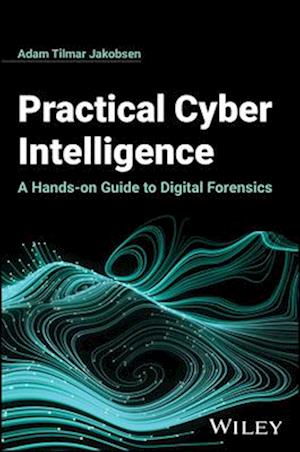

  

    
  

  

    <h1>Pratical cyber intelligence</h1>
    

The book delves into the myriad tactics, techniques, and procedures essential for conducting cyber investigations and forensic analyses.

Within its pages, I explore the realms of traditional digital forensics, uncovering the evidence concealed within digital devices. Additionally, I delve into the realm of open-source intelligence (OSINT) and its potential to yield valuable information.

In essence, "Practical Cyber Investigation" aspires to serve as an invaluable resource for individuals eager to grasp the intricacies of computer systems and the diverse approaches for extracting information from them. It is designed to offer a comprehensive and pragmatic introduction to this field, making it an indispensable asset for those aspiring to enter or progress in the realm of cyber investigation.

  

  

  

  

    <h1>Zero trust - hand on (WIP)</h1>
    

The goal of this book is to provide a hands-on approach to understanding and implementing zero trust architecture.

  

