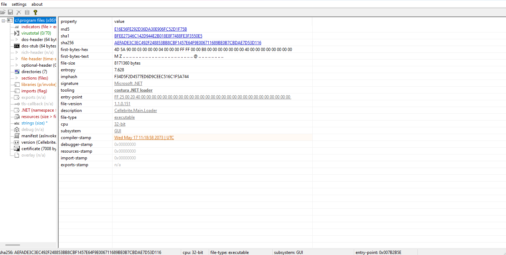

Malware analysis is the study of malware, aiming to understand its behavior. What sets malware analysis apart from other forms of reverse engineering is that malware typically tries to take control of a system. This is why it's important to use an isolated environment separate from the rest of the network, ensuring that the malware doesn't accidentally infect the entire network.

Like other reverse engineering disciplines, malware analysis requires a high level of technical expertise, as well as a deep understanding of computer systems and security. Malware analysis is an essential tool in cybersecurity, allowing practitioners to develop countermeasures and protect against attacks. It's also used by researchers and law enforcement to study and investigate malware developers, as each piece of malware leaves behind clues about its creator. In some cases, malware developers may even intentionally leave such clues. The analysis process involves using various tools and techniques, such as disassemblers, debuggers, and sandbox environments, to reverse engineer the malware's code and behavior, and identify its capabilities, techniques, and potential weaknesses. Most of my experience is with Windows malware, so this discussion will primarily focus on that perspective.

Malware can come in many forms, including documents with macros, scripts, executable files, and more. Malware can also use multiple technologies to achieve its goals. For example, a phishing email might contain a link to a macro-embedded Word file, followed by shell code that downloads the next module, and finally a PowerShell command to download the final payload. This is just one example; the possibilities are endless, and it's up to the malware author to be as creative as possible to evade anti-virus detection.

When analyzing malware, it's crucial to be knowledgeable about various technologies and the tricks that malware authors use to bypass security controls. In this discussion, I will go over the basics of malware analysis, how to set up a secure environment for analysis, and some common practices for handling different types of malware.

### Acquiring Malware Samples

Before you can begin analyzing malware, you need samples to analyze. A good starting point is using malware samples that others have already analyzed, allowing you to compare your results. There are several websites with extensive collections of malware samples available for download. Here's a list of some sites where you can find malware samples:

<div style="text-align: center;">
  
</div>


General malware repositories:

* [vx-underground](https://www.vx-underground.org/)
* [malshare](https://malshare.com/)
* [Malware bazaar](https://bazaar.abuse.ch/)

Mac-specific malware: [Objective-See](https://objective-see.com/malware.html)

Please note that these samples are live malware and can be harmful. Always exercise caution and ensure that you're working in a secure, isolated environment when handling malware samples. Additionally, make sure to abide by any terms and conditions set by the websites providing these samples.

### Handling Malware Samples

When acquiring malware samples, it is crucial to avoid infecting your machine. A common method for transferring samples between devices is to contain them within a password-protected archive. This prevents accidental execution and stops antivirus software from scanning the file and containing it.\
Another approach is to _defang_ the sample by removing the extension.

**Virtual Environment**

Active analysis of malware involves executing the malware in a controlled environment to monitor its activity.\
Since we are working with live malware that can take control of the computer and spread itself to other systems, it is essential that analysis is done inside a contained environment.\
Virtual machines can help with this, using software such as VMware or VirtualBox.

<div style="text-align: center;">
  
</div>


As most malware targets Windows, it's a good idea to have two virtual machines: a Windows machine for executing and monitoring malware without risking infecting the whole network, and a Linux machine for analyzing the malware without the risk of infection. Linux is chosen because malware is less likely to be designed for it, and many malware analysis tools are developed for Linux systems.\
Microsoft provides virtual images for evaluation, such as this [Windows 10 image](https://developer.microsoft.com/en-us/microsoft-edge/tools/vms/). For Linux forensic images, [REMnux](https://remnux.org) is useful as it comes pre-installed with malware analysis tools.\
**Remember** to take a snapshot of the image before executing any samples, or you risk having to reinstall the environment anew.

Many malware samples perform an internet check to see if they are on an internet-connected host and identify if they are within a sandbox. If they cannot connect, they might self-destruct.\
To set up a fake network, use either [Fakenet-ng](https://github.com/mandiant/flare-fakenet-ng) or [INetSim](https://www.inetsim.org/). Both solutions simulate a network for the malware to connect to.\
If the sample connects to hardcoded IP addresses, change the iptable on the Linux machine to accept all IP requests.

Enable iptables redirection:

```
iptables -t nat -A PREROUTING -i eth0 -j REDIRECT
```

Disable iptable redirection:

```
iptables -t nat -D PREROUTING -i eth0 -j REDIRECT
```

On REMnux, you can use the _accept-all-ips_ service:

```
accept-all-ips start
```

Set up the environment by forwarding the Windows machine's network to the Linux machine, which runs INetSim to simulate a network and Wireshark for packet analysis.
This is how I have setup my malware analysis enviroment.

## Analysis

The method of analysis involves examining the system while it is dormant (static analysis) and looking at the code at runtime (dynamic analysis). This section is structured in the order of analyzing malware: first by reviewing the static properties, followed by dynamic analysis, and, if necessary, code analysis.

### Static property analysis

Static property analysis involves examining malware without executing it. This analysis delves into surface-level information such as file attributes, the compiler used, code signing, embedded strings, and more. This process helps us understand the type of executable we are working with. An easy way to perform this analysis is by using [PEStudio](https://www.winitor.com/download), which examines all the file attributes and highlights data that may indicate a malicious file.

<div style="text-align: center;">
  
</div>


Understanding the attributes of a Windows PE file is essential because the compilation method affects how we analyze it. For example, a sample written in _C_ is analyzed using a disassembler such as Ghidra, while a file compiled with _.NET_ requires dnSpy. Automating this stage as much as possible helps reduce the time spent on each sample.

Code signing provides information about the code's author, allowing analysts to determine if the binary originates from a known source and whether it has been modified since its last signing. By examining the author of the file, analysts can quickly determine if the sample is benign or malicious.

Binary files contain text, such as the libraries they use, hard-coded URLs, and more. The strings command enables analysts to view the strings within a compiled binary, providing insight into the sample's capabilities. Examining strings within the sample can reveal information such as:

* Messages
* Method or function names
* Configuration files
* URLs
* API calls


### Dynamic Analysis

Dynamic analysis involves systematically interacting with an application at runtime and observing its behavior. Virtual environments are often used for this purpose, as they allow for greater control over variables. The process involves comparing the system before and after interactions and documenting any changes observed.\
This process allows the malware to be safely executed, monitored, and recorded, including the files and resources it accesses, the network connections it establishes, and any other actions it performs. Dynamic analysis can be performed using a sandbox or a debugger. Both tools hook into the program, allowing you to control the application's flow and perform code patches at runtime, providing valuable insights into the malware's behavior and characteristics.

**Sandbox with Cuckoo**

A sandbox automates the entire process of dynamically analyzing samples by setting up a virtual environment that hooks into the sample and observes its behavior. [Cuckoo Sandbox](https://cuckoosandbox.org) is a widely recommended open-source project that generates a report outlining the sample's behavior. To experiment with Cuckoo without installing it, try using [cuckoo.cert.ee](https://cuckoo.cert.ee/). Keep in mind that anything you upload to a public sandbox can be viewed by everyone.

<div style="text-align: center;">
  
</div>


*Installation*\
To install Cuckoo on your own system without worrying about samples becoming publicly available, use Vagrant, which simplifies the process. Ensure you have Vagrant and Packer installed on your machine by visiting [https://www.vagrantup.com](https://www.vagrantup.com/) and [https://www.packer.io/](https://www.packer.io/).

A project called _BoomBox_ has set up Cuckoo using Vagrant, but it is no longer up-to-date. To resolve compatibility issues with newer Vagrant versions, use a fork of the project:

```
git clone https://github.com/Paradoxxs/BoomBox
```

Set everything up on Windows:

```
./build.ps1 -ProviderName virtualbox -VagrantOnly
```

If only the sandbox is set up, run the following command to bring up the **cuckoo** image. Ensure you run the command inside the Vagrant folder, or it will fail.

```
vagrant up cuckoo
```

Once completed, access Cuckoo at http://192.168.30.100:8080 with the username and password "vagrant." Upload samples using the web interface and make REST API queries to the server, which should be available on port 8090. Find the available API calls in the [Cuckoo documentation](https://cuckoo.readthedocs.io/en/latest/usage/api/#resources).


### Code-analysis


Code analysis involves disassembling or decompiling the malware to understand its inner workings. This is typically done using disassemblers or decompilers, depending on the language the malware was written in.

**Disassemblers**

Disassemblers are tools that translate the machine code of a binary into a human-readable assembly language. They are commonly used to analyze malware samples written in low-level languages like C or C++.

* [Ghidra](https://ghidra-sre.org/): Ghidra is an open-source software reverse engineering (SRE) suite developed by the National Security Agency (NSA) of the United States. It includes a disassembler, decompiler, and various other analysis tools.
* [IDA Pro](https://www.hex-rays.com/products/ida/): IDA Pro is a popular commercial disassembler that supports a wide range of processor instructions and executable formats. It also includes a built-in debugger, making it a powerful tool for reverse engineering and malware analysis.

<div style="text-align: center;">
  
</div>

**Decompilers**

Decompilers are tools that translate the compiled code back into a high-level language, such as C# or Java. They are useful for analyzing malware samples written in high-level languages like .NET or Java.

* [dnSpy](https://github.com/dnSpy/dnSpy): dnSpy is a powerful open-source .NET debugger and assembly editor, which also includes a decompiler. It can be used to analyze malware samples written in .NET languages like C# or VB.NET.
* [Jadx](https://github.com/skylot/jadx): Jadx is an open-source Java decompiler, which can be used to analyze malware samples written in Java. It can convert Android APK files, DEX files, or Java class files back into Java source code.


When starting on code analysis here are a few good starting points:

* What API calls does the program makes, and what are the parameters that are passed to the API calls
* Is there any logic flow based on the returns from the calls, if there isn't an test after an call it most likely not of interest as the function called not does have an return value and most likely an utility function.
* If the same function is called multiple times there high possibility it a decryption function.


### Summary

The techniques used to analysis malware can be used to analysis any kind of system ,the tools might be slightly different depending upon the target, but the approach is always the same  of using a combination of static and dynmatic analysis of the target in question. 

Malware analysis is an essential aspect of cybersecurity, particularly in cases involving ransomware and other cybercrimes. This introduction covered various methods and tools for malware analysis, including static, dynamic, and code analysis. Depending on the specific case, different techniques may be more relevant or effective.

For those interested in deepening their knowledge of malware analysis, there are many resources available. TCM-Security's "Practical Malware Analysis & Triage" offers an excellent balance of depth and value, covering the basics of dynamic and code analysis and a section on automation.

When it comes to books, "Practical Malware Analysis" by Michael and Andrew is considered one of the best in the field. It covers a wide range of topics, from the basics to more complex issues. However, it focuses on IDA Pro, an expensive tool, which may not be accessible for everyone. To supplement this, "The Ghidra Book" by Chris and Kara can be a valuable resource, as it allows readers to tackle the problems presented in the book without relying on costly tools.

Overall, malware analysis is a critical skill in cybersecurity, and there are numerous resources available to help you develop your expertise in this area.


